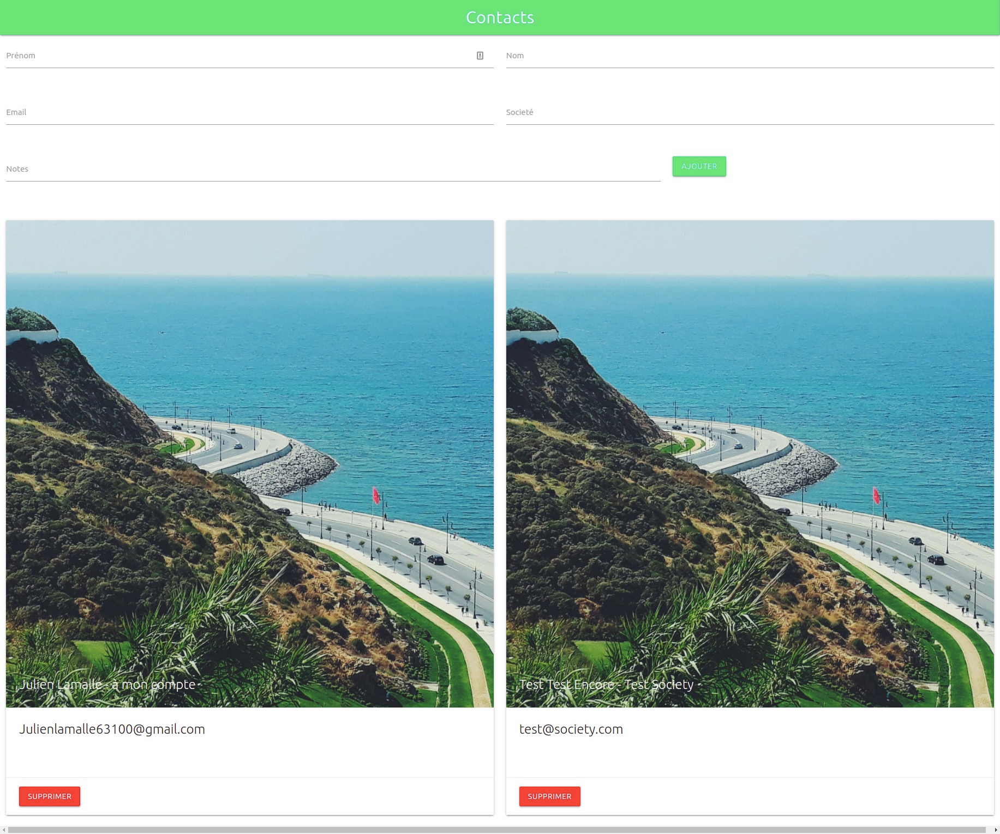

## CRM built with Firebase for the backend and React for the front end

I used Materialize CSS to save time in the execution of the front-end part.

If you want to use this project you will need to configure your back-end part on firebase and add your information about Firebase in the file :

```
firebase.js
```

This project currently allows the creation of a customer card, with the name, first name, email, company and a note about it.

You can create an account system or modify, add or delete the information that will be displayed about customers.

Here is a screenshot of the project:

